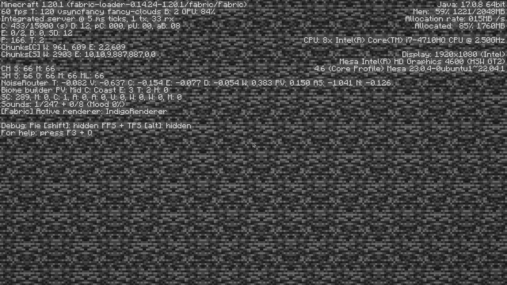
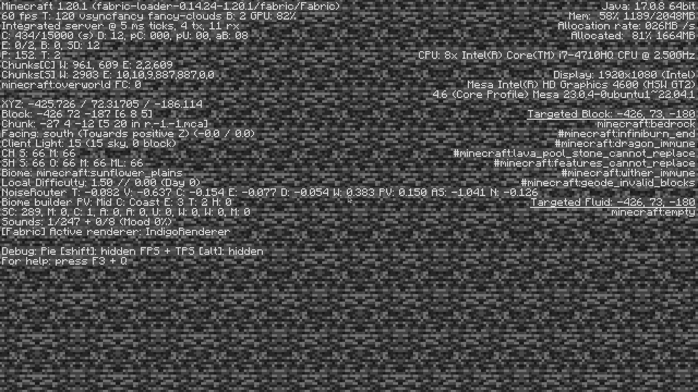

# noF3

A simple Minecraft client mod built with Fabric that hides F3 coordinates, biome data, light levels, local difficulty and more.

 

⚠ This mod relies on the [Fabric API](https://www.curseforge.com/minecraft/mc-mods/fabric-api).

⚠ This mod is NOT compatible with [BetterF3](https://www.curseforge.com/minecraft/mc-mods/betterf3).

⚠ If you want to remove debug info for everyone on your server, just type '/gamerule reducedDebugInfo true' and do not use this mod.

 

### Download
You can download this mod on [CurseForge](https://www.curseforge.com/minecraft/mc-mods/nof3_) and [Modrinth](https://modrinth.com/mod/nof3).

 

### Features

This mod hide the following informations :    
- Dimension infos
- Coordinates
- Targeted block informations
- Current chunck location
- Player orientation
- Client light informations
- Biome informations
- Local Difficulty informations   
- Targeted fluid informations

With the mod :

Without the mod :
